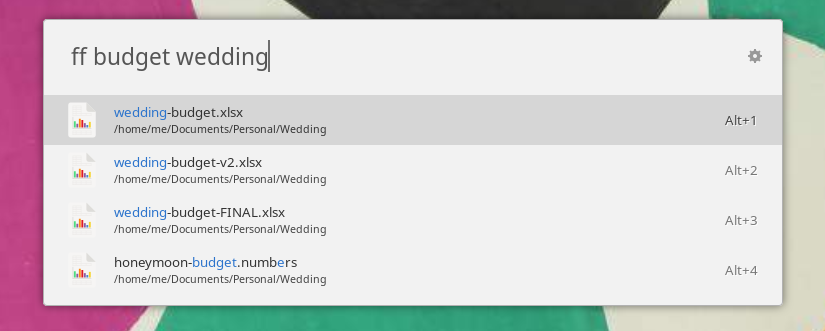
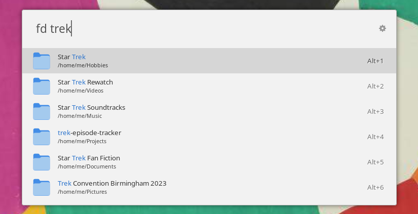
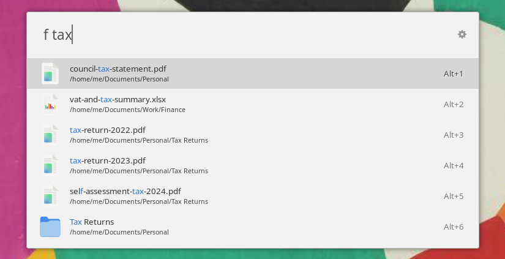
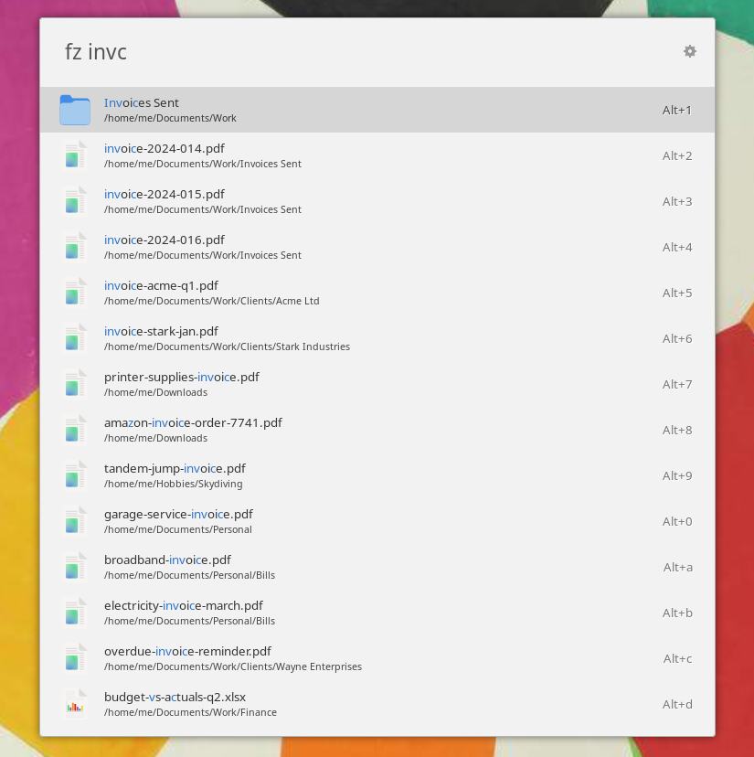

# Find

[](LICENCE)

A [Ulauncher](https://ulauncher.io/) extension for finding files and directories by name. It uses [`fd`](https://github.com/sharkdp/fd) for instant real-time search with no index to maintain, and optional fuzzy matching through [`fzf`](https://github.com/junegunn/fzf).


Part of the [No Faff](https://github.com/no-faff) suite.

## Keywords

Type a keyword, a space, then your query:

- `f`: files and directories
- `ff`: files only
- `fd`: directories only
- `fz`: fuzzy match, files and directories

So `ff budget` finds files with "budget" in the name, and `fd trek` finds directories to do with Star Trek.

## Matching

A single word matches against the filename. Type more than one word and it narrows: every word has to appear somewhere in the path, in any order. `ff budget wedding` keeps only the wedding budgets, and in `honeymoon-budget.numbers` the word "budget" matches the filename while "wedding" matches its parent folder. Words match literally, so `.`, `?` and `*` are treated as themselves rather than as wildcards.



Results from `f`, `ff` and `fd` are ordered by relevance, so a file whose name contains more of your words ranks above one that only matches through a parent folder. `fz` uses fzf's own fuzzy ranking instead.

## More examples

`fd` searches directories only:



`f` searches files and folders together:



`fz` matches fuzzily, so `fz invc` finds the invoices ranked by quality:



## Requirements

- Ulauncher 6
- [`fd`](https://github.com/sharkdp/fd)
- [`fzf`](https://github.com/junegunn/fzf), only if you use the `fz` keyword

```bash
# Fedora
sudo dnf install fd-find fzf

# Debian and Ubuntu (fd ships as fdfind)
sudo apt install fd-find fzf
```

## Install

Open Ulauncher, go to Extensions, click Add extension and paste:

```
https://github.com/no-faff/ulauncher-find
```

## Opening a result

Use the arrow keys to pick a result, then Enter to open it. Alt+Enter, or a right-click, shows its action menu: Open, plus a second action you choose in the preferences. The second action opens the containing folder, opens a terminal there, or copies the path to the clipboard. Pick an item from the menu with the arrow keys and Enter.

## Settings

| Setting | Description | Default |
|---|---|---|
| Keywords | The trigger word for each mode | `f`, `ff`, `fd`, `fz` |
| Alt+Enter action | Open the containing folder, open a terminal there, or copy the path | Open containing folder |
| Base directory | Where to search from. Comma-separate several, e.g. `~,/data`. `/` searches everywhere but walks `/proc`, `/sys`, `/usr` and every mount, so it is slow | `~` |
| Result limit | How many results to show | 15 |
| Search time limit | Seconds to keep searching before showing results, for a search that finds fewer than the result limit. Lower is snappier, higher catches more across large drives or separate partitions | 5 |
| Include hidden files | Search dotfiles and dot-directories | No |
| Follow symbolic links | Follow symlinked directories | No |
| Ignore file | Path to a .gitignore-style file of paths to skip | (blank) |
| Terminal command | Terminal for "open in terminal". Blank auto-detects. For an unsupported one, give a full command with `{}` as the directory, e.g. `myterm --cd {}` | (blank) |

## Speed

There is no index, so each search walks the directories live. That is effectively instant somewhere small like your home folder, but a separate partition or a mounted drive is slower to walk, especially the first time before the filesystem cache is warm.

A search that matches only a few files is slower than one that matches lots, because `fd` cannot know there are no more matches until it has walked everything. The search time limit handles that: it shows what it found once the limit is up. So point the base directory at where your files actually live rather than at `/`, and if a file you know exists does not show on a cold drive, raise the limit.

## Licence

MIT, see [LICENCE](LICENCE).
