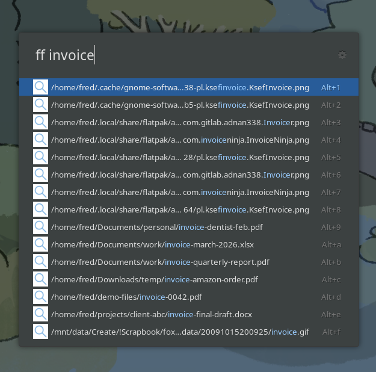

# Find

A [Ulauncher](https://ulauncher.io/) extension for finding files and directories by name. Uses `fd` for instant real-time results, with optional fuzzy matching via `fzf`.



## Features

- Four keywords: `f` (files and directories), `ff` (files only), `fd` (directories only), `fz` (fuzzy match)
- Real-time search with no index to maintain
- System icons matching your desktop theme
- Two-line results: filename on top, parent directory below
- Configurable base directory, result limit, Alt+Enter action and more

## Requirements

- Ulauncher 6 (Extension API v2)
- fd
- fzf (only needed if you use the `fz` fuzzy keyword)

Install them if you don't have them:

```bash
# Fedora
sudo dnf install fd-find fzf

# Ubuntu/Debian (fd is packaged as fdfind)
sudo apt install fd-find fzf
```

## Install

Open Ulauncher preferences, go to Extensions, click "Add extension" and paste:

```
https://github.com/no-faff/ulauncher-find
```

## Settings

| Setting | Description | Default |
|---|---|---|
| Keywords | Trigger keywords for each search mode | `f`, `ff`, `fd`, `fz` |
| Alt+Enter action | Open containing folder, open in terminal, or copy path | Open containing folder |
| Base directory | Where to search. Comma-separate for multiple roots, e.g. `~,/mnt/data`. `/` works but walks `/proc`, `/sys`, `/usr` etc so it's slow | `~` |
| Result limit | Maximum results shown | 15 |
| Include hidden files | Search dotfiles and dot-directories | No |
| Follow symbolic links | Follow symlinked directories | No |
| Ignore file | Path to a .gitignore-style file of paths to skip | (blank) |
| Terminal command | Terminal for "open in terminal". Blank to auto-detect. For an unsupported terminal, supply a full command with `{}` as the directory, e.g. `myterm --cd {}` | (blank) |

## Usage

| Action | What it does |
|---|---|
| Enter | Opens the file or directory |
| Alt+Enter | Configurable: open folder, open terminal, or copy path |

The non-fuzzy keywords (`f`, `ff`, `fd`) match the query as a literal substring against the full path, so `f crap j` finds anything under `/.../crap journalism/...`. Characters like `.`, `?` and `*` are treated as themselves.

### Tips for fast searches

- Set **base directory** to where your content actually lives, e.g. `~,/mnt/data`. Searching `/` walks the whole filesystem including `/proc`, `/sys`, `/usr` and every mount, which makes narrow queries hit the 5 second timeout.
- A narrow query on a wide base directory is slower than a broad one, because `fd` has no way to know there aren't more matches until it's walked everything.

## Licence

MIT
